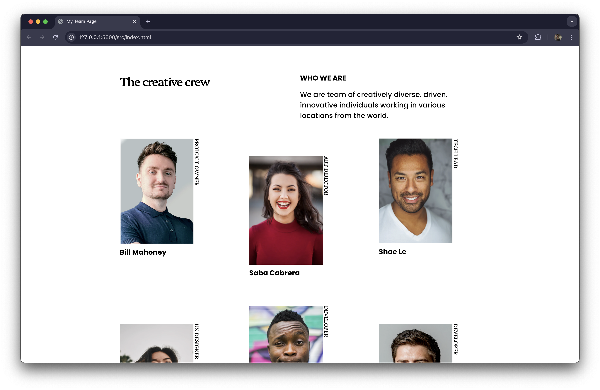

# Make It Real - My Team Page

This is a solution to the **My Team Page** project of the Make It Real course.

## Table of contents

- [Overview](#overview)
  - [The challenge](#the-challenge)
  - [Screenshot](#screenshot)
- [My process](#my-process)
  - [Built with](#built-with)
  - [What I learned](#what-i-learned)
  - [Continued development](#continued-development)
  - [Useful resources](#useful-resources)
- [Author](#author)
- [Acknowledgments](#acknowledgments)

## Overview

### The challenge

- Build the basic structure of the page with HTML.
- Apply styles to the page using CSS following the layouts indicated in the "design" folder.

### Screenshot



## My process

### Built with

- Semantic HTML5 markup
- CSS custom properties
- Flexbox
- Mobile-first workflow

### What I learned

This project especially helped me to reinforce advanced or unusual CSS properties.
```html
<body>
  <main>
    <section class="txt-wrapper">
      <h1>The creative crew</h1>
      <div class="txt-info">
          <h2>Who we are</h2>
          <p>We are team of creatively diverse. driven. innovative individuals working in various locations from the world.</p>
      </div>
    </section>
    <section class="imgs-wrapper">
      <div class="single-card">
        <figure>
          
          <figcaption>Bill Mahoney</figcaption>
        </figure>
        <div class="role">Product Owner</div>
      </div>
      ...
    </section>
  </main>
  <footer>...</footer>
<body>
```
```css
section.imgs-wrapper > *:nth-child(even) {
  padding-top: 3rem;
}

div.single-card {
  display: flex;
  gap: 0rem;

  .role {
    writing-mode: vertical-rl;
    font-family: 'Platypi', Georgia, serif;
    font-size: clamp(var(--small-font-size), 2.4vw, var(--regular-font-size));
    text-transform: uppercase;
  }

  figure figcaption {
    font-size: clamp(var(--regular-font-size), 3.7vw, var(--subtitle-font-size));
    font-weight: 700;
    margin-top: 0.5rem;
  }
}
```

### Continued development

Working on this project made me realize that there are still advanced CSS topics to learn, such as the dynamic font size in relation to the *viewport width* or the `writing-mode` property to define the direction of the content of an element.

### Useful resources

- [writing-mode - CSS](https://developer.mozilla.org/en-US/docs/Web/CSS/writing-mode) - This CSS property helped me to set the direction of the role text vertically in a simple way.
- [clamp() - CSS](https://developer.mozilla.org/en-US/docs/Web/CSS/clamp) - This CSS feature helped me to manage the font size dynamically, setting a minimum value, a preferred value and a maximum value. This was very useful for responsive design.

## Author

- Website - [Heberth López](https://www.heblopez.web.app)

## Acknowledgments

A special thanks to the MakeItReal team for the knowledge and support provided in each class and the feedback received on each project.
